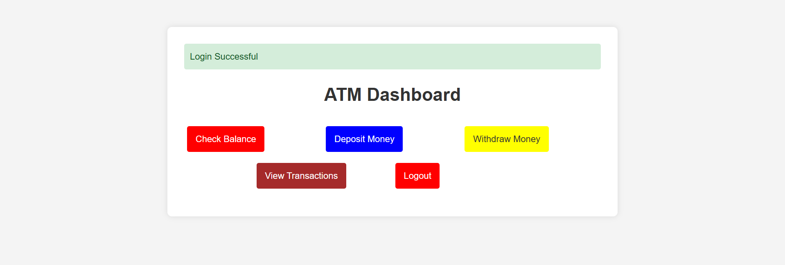

# 🏦 ATM Banking Application 🏦



## Overview

This is an **ATM Banking Application** built as part of my full-stack development training. The application simulates real ATM operations with multi-language support (English/Hindi), allowing users to perform balance checks, deposits, withdrawals, and view transaction history. The system uses **Flask** for the backend, **MySQL** for database management, and **Bootstrap** for the frontend styling.

## Key Features

### 🌐 Multi-Language Support:
- English/Hindi language selection at startup
- Dynamic text switching using session management

### 💳 Core Banking Operations:
- Secure user authentication with PIN verification
- Real-time balance checking
- Deposit/Withdrawal functionality with transaction recording
- Transaction history tracking with timestamps

### 🔒 Security Features:
- Session-based authentication
- PIN confirmation for sensitive operations
- Flash messages for user feedback
- Protected routes for authenticated users only

## 💻 Technologies Used
- 🟢 **Backend**: Python, Flask, MySQL
- 🟢 **Frontend**: HTML, CSS, Bootstrap, Jinja2 Templating
- 🟢 **Database**: MySQL
- 🟢 **Security**: Session management, PIN hashing (to be implemented)

## Project Highlights:
- Implemented complete ATM workflow with financial transaction logic
- Developed dual-language support system using session variables
- Created secure transaction system with PIN verification at multiple stages
- Designed clean UI with Bootstrap and custom CSS animations
- Implemented comprehensive transaction history tracking

## 💡 Learning Outcomes:
- Financial transaction handling and balance calculations
- Multi-language implementation in web applications
- Security best practices for banking applications
- Transaction recording and history management
- Error handling for financial operations

## Steps to Set Up and Run the Project

### 1. Create Virtual Environment
```
mkdir atm_project
cd atm_project
python -m venv venv
```

### 2. Activate the Virtual Environment
On Windows:
```
venv\Scripts\activate
```

### 3. Install the Required Packages
Inside the virtual environment, install Flask and MySQL connector:
```
pip install flask mysql-connector-python pandas
```
### 4. Create the Project Structure
```
atm_project/
├── venv/
├── app.py
├── database.sql
├── templates/
│   ├── base.html
│   ├── dashboard.html
│   ├── deposit.html
│   ├── language_selection.html
│   ├── login.html
│   ├── view_history.html
│   └── withdraw.html
├── static/
│   └── style.css
└── assets/
    └── dashboard.png
```

### 5.Database Setup
Create MySQL database:
```
CREATE DATABASE user_db;
```
Import database schema from database.sql

### 6. Configuration
Update MySQL credentials in app.py:
```
db = mysql.connector.connect(
    host="localhost",
    user="root",
    password="Your_Password",
    database="Your_db"
)
```
### 7. Run Application
```
python app.py
```
Access the application at: http://127.0.0.1:5000

⚠️ Note: For production use, implement proper password hashing and environment variables for sensitive data.
